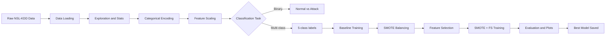

# Intrusion Detection System — Project Report

> **Dataset**: NSL-KDD (improved KDD Cup 1999)  
> **Task**: Multi-class network intrusion classification  
> **Algorithms**: 6 ML models × 4 experimental configurations  
> **Code Location**: [d:\Codes\Research_P\Intrusion-Detection-System](file:///d:/Codes/Research_P/Intrusion-Detection-System)

---

## 1. Project Overview

This project implements a **Machine-Learning-based Intrusion Detection System (IDS)** that classifies network traffic connections as either normal or one of four attack categories. The system is built on the **NSL-KDD** dataset and benchmarks six classical ML algorithms under four progressively enhanced configurations.

The full pipeline flows through these phases:



---

## 2. Dataset — NSL-KDD

| Property | Value |
|---|---|
| Source | NSL-KDD (University of New Brunswick) |
| Train file | `data/KDDTrain+.txt` |
| Test file | `data/KDDTest+.txt` |
| Train samples | ~125,973 connections |
| Test samples | ~22,544 connections |
| Raw columns | 43 (41 features + `intrusion_type` + `difficulty`) |
| Features used | **41** (`difficulty` always dropped) |
| Missing values | **0** (dataset is clean) |

### 2.1 Attack Categories

The 38 specific attack types in NSL-KDD are grouped into **5 classes**:

| Category | Meaning | Example Attacks |
|---|---|---|
| **Normal** | Legitimate traffic | — |
| **DoS** | Denial-of-Service | `neptune`, `smurf`, `back`, `teardrop`, `pod` |
| **Probe** | Reconnaissance / Scanning | `ipsweep`, `portsweep`, `nmap`, `satan` |
| **R2L** | Remote-to-Local (unauthorized access) | `guess_passwd`, `ftp_write`, `imap`, `warezmaster` |
| **U2R** | User-to-Root (privilege escalation) | `buffer_overflow`, `rootkit`, `perl`, `sqlattack` |

> [!NOTE]
> R2L and U2R are severely minority classes. The training set can have fewer than 100 U2R samples vs. tens-of-thousands of DoS samples — this class imbalance is one of the core challenges that SMOTE addresses.

---

## 3. The 41 Input Features

All 41 features come from the NSL-KDD schema, divided into four conceptual groups:

### 3.1 Basic Features (9 features) — from packet headers

| Feature | Type | Description |
|---|---|---|
| `duration` | int | Length (seconds) of the connection |
| `protocol_type` | **categorical** | Protocol used: `tcp`, `udp`, `icmp` |
| `service` | **categorical** | Network service on destination (e.g. `http`, `ftp`, `smtp`) |
| `flag` | **categorical** | Connection status flag (e.g. `SF`=normal, `S0`=no response) |
| `src_bytes` | int | Bytes sent from source to destination |
| `dst_bytes` | int | Bytes sent from destination to source |
| `land` | binary | 1 if source/dest host+port are same |
| `wrong_fragment` | int | Number of wrong fragments |
| `urgent` | int | Number of urgent packets |

### 3.2 Content Features (13 features) — payload-level signals

| Feature | Type | Description |
|---|---|---|
| `hot` | int | Number of "hot" indicators |
| `num_failed_logins` | int | Number of failed login attempts |
| `logged_in` | binary | 1 if successfully logged in |
| `num_compromised` | int | Number of compromised conditions |
| `root_shell` | binary | 1 if root shell obtained |
| `su_attempted` | binary | 1 if `su root` command attempted |
| `num_root` | int | Number of root accesses |
| `num_file_creations` | int | Number of file creation operations |
| `num_shells` | int | Number of shell prompts |
| `num_access_files` | int | Number of operations on access control files |
| `num_outbound_cmds` | int | Number of outbound commands in FTP session |
| `is_host_login` | binary | 1 if login belongs to "hot" list |
| `is_guest_login` | binary | 1 if login is a guest login |

### 3.3 Time-Based Traffic Features (9 features) — connections in past 2 seconds

| Feature | Type | Description |
|---|---|---|
| `count` | int | Connections to same host in past 2 seconds |
| `srv_count` | int | Connections to same service in past 2 seconds |
| `serror_rate` | float | % connections with SYN errors |
| `srv_serror_rate` | float | % connections to same service with SYN errors |
| `rerror_rate` | float | % connections with REJ errors |
| `srv_rerror_rate` | float | % connections to same service with REJ errors |
| `same_srv_rate` | float | % connections to same service |
| `diff_srv_rate` | float | % connections to different services |
| `srv_diff_host_rate` | float | % connections to different hosts |

### 3.4 Host-Based Traffic Features (10 features) — last 100 connections to same host

| Feature | Type | Description |
|---|---|---|
| `dst_host_count` | int | Count of connections to same dest host |
| `dst_host_srv_count` | int | Count of connections to same service on dest |
| `dst_host_same_srv_rate` | float | % connections to same service |
| `dst_host_diff_srv_rate` | float | % connections to different services |
| `dst_host_same_src_port_rate` | float | % connections with same source port |
| `dst_host_srv_diff_host_rate` | float | % connections to different dest hosts (same service) |
| `dst_host_serror_rate` | float | % connections with SYN errors (host-based) |
| `dst_host_srv_serror_rate` | float | % connections to same service with SYN errors |
| `dst_host_rerror_rate` | float | % connections with REJ errors |
| `dst_host_srv_rerror_rate` | float | % connections to same service with REJ errors |

### 3.5 Column Dropped at Load Time

| Feature | Reason Dropped |
|---|---|
| `difficulty` | Meta-column (NSL-KDD artifact indicating sample difficulty); not a real network traffic attribute |

> [!IMPORTANT]
> The `difficulty` column is **always dropped** during data loading ([data_loader.py](file:///d:/Codes/Research_P/Intrusion-Detection-System/src/data_loader.py#L32-L34)). It was added by the NSL-KDD creators to indicate how difficult a record is to classify — using it would be data leakage.

---

## 4. Preprocessing Pipeline

### 4.1 Categorical Encoding

The three categorical columns (`protocol_type`, `service`, `flag`) are encoded using **scikit-learn `LabelEncoder`**:

- Fit on **combined unique values** of both train + test sets to avoid unseen-label errors during testing.
- Avoids one-hot explosion while remaining compatible with tree-based and linear models.

| Column | Unique Values | Encoding |
|---|---|---|
| `protocol_type` | 3 (tcp, udp, icmp) | Ordinal integer 0–2 |
| `service` | ~70 distinct services | Ordinal integer |
| `flag` | ~11 connection flags | Ordinal integer |

### 4.2 Feature Scaling

All 41 features normalized using **`StandardScaler`** (zero mean, unit variance):
- Scaler **fit only on training data**, applied to test data — no data leakage.
- Critical for KNN and Logistic Regression; tree-based models are unaffected but benefit from numerical stability.

### 4.3 Label Creation

**Binary task:**
- `normal` → `0`
- All attack types → `1`

**Multi-class task:**
- `normal` → `Normal`
- `{back, neptune, smurf, …}` → `DoS`
- `{ipsweep, nmap, portsweep, …}` → `Probe`
- `{guess_passwd, ftp_write, …}` → `R2L`
- `{buffer_overflow, rootkit, …}` → `U2R`

---

## 5. Class Imbalance Handling — SMOTE

The NSL-KDD training set is heavily imbalanced:

| Class | Approx. Count | % of Total |
|---|---|---|
| Normal | ~67,343 | 53.4% |
| DoS | ~45,927 | 36.4% |
| Probe | ~11,656 | 9.2% |
| R2L | ~995 | 0.8% |
| U2R | ~52 | 0.04% |

**SMOTE (Synthetic Minority Over-sampling Technique)** applied to training set only:
- Generates synthetic samples for minority classes by interpolating in feature space.
- All classes up-sampled to match majority class count.
- Applied **before** model training; test set is never modified.

> [!WARNING]
> SMOTE can slow training significantly — Logistic Regression with SMOTE took ~91.6 s vs ~15.6 s baseline, due to the massively expanded dataset size.

---

## 6. Feature Selection

Three strategies were compared, all targeting **top-20 features**:

### Method 1 — Correlation-based (threshold = 0.95)
Drops features that are highly correlated (|ρ| > 0.95) with any other feature.

### Method 2 — SelectKBest (ANOVA F-test)
Uses `sklearn.feature_selection.SelectKBest` with `f_classif` to select the 20 features with the highest ANOVA F-statistic.

### Method 3 — Random Forest Feature Importance (chosen as final method)
Trains a 100-tree `RandomForestClassifier` and ranks features by mean decrease in impurity (Gini importance). Top-20 selected.

**Why RF importance was chosen:** Accounts for non-linear feature interactions, robust to scale, consistently selected features from all four conceptual groups, and produced the best downstream model accuracy.

| Method | Features Retained |
|---|---|
| Baseline (no FS) | 41 |
| Correlation | ~35–38 |
| SelectKBest | 20 |
| RF Importance | 20 |

---

## 7. Machine Learning Models

| # | Model | Key Hyperparameters |
|---|---|---|
| 1 | **Decision Tree** | `random_state=42` |
| 2 | **Random Forest** | `n_estimators=100`, `n_jobs=-1` |
| 3 | **KNN** | `n_neighbors=5`, `n_jobs=-1` |
| 4 | **Logistic Regression** | `max_iter=1000`, `n_jobs=-1` |
| 5 | **XGBoost** | `n_estimators=100`, `eval_metric=logloss` |
| 6 | **Naive Bayes** | Gaussian NB (defaults) |

### How Prediction Works (Multi-class)

1. A new connection → **41-dimensional vector** (after same encoding + scaling as training).
2. If FS was used → reduce to **top-20 RF-importance features**.
3. Model outputs one of: `Normal`, `DoS`, `Probe`, `R2L`, `U2R`.
4. For XGBoost multi-class: string labels mapped to integers (`0–4`), `multi:softmax` objective used.

---

## 8. Experimental Configurations

| Config | SMOTE | Feature Selection | Description |
|---|---|---|---|
| **Baseline** | No | No | Raw 41 features, imbalanced data |
| **With SMOTE** | Yes | No | All 41 features, balanced training |
| **With FS** | No | RF top-20 | 20 features, imbalanced data |
| **SMOTE + FS** | Yes | RF top-20 | 20 features, balanced training |

---

## 9. Results — Multi-Class Classification

### Baseline (No SMOTE, No FS)

| Model | Accuracy | Precision | Recall | F1-Score | Train Time |
|---|---|---|---|---|---|
| Decision Tree | 76.08% | 79.54% | 76.08% | 71.90% | 2.06 s |
| Random Forest | 75.12% | 81.53% | 75.12% | 70.99% | 6.52 s |
| KNN | 74.96% | 80.25% | 74.96% | 70.56% | 0.06 s |
| Logistic Regression | 76.21% | 75.53% | 76.21% | 71.44% | 15.56 s |
| XGBoost | 75.74% | 79.75% | 75.74% | 71.04% | 7.25 s |
| **Naive Bayes** | **43.30%** | **55.81%** | **43.30%** | **34.70%** | 0.20 s |

### With SMOTE

| Model | Accuracy | Precision | Recall | F1-Score | Train Time |
|---|---|---|---|---|---|
| Decision Tree | 74.33% | 72.39% | 74.33% | 69.97% | 12.70 s |
| Random Forest | 74.55% | 80.00% | 74.55% | 70.15% | 26.77 s |
| KNN | 75.61% | 79.94% | 75.61% | 71.53% | 0.21 s |
| **Logistic Regression** | **79.21%** | **82.59%** | **79.21%** | **77.76%** | 91.63 s |
| XGBoost | 77.65% | 82.93% | 77.65% | 74.71% | 20.43 s |
| Naive Bayes | 45.28% | 53.40% | 45.28% | 37.93% | 0.62 s |

### With Feature Selection (RF Importance, k=20)

| Model | Accuracy | Precision | Recall | F1-Score | Train Time |
|---|---|---|---|---|---|
| Decision Tree | 73.51% | 69.25% | 73.51% | 69.35% | 1.04 s |
| Random Forest | 75.03% | 79.69% | 75.03% | 70.32% | 6.17 s |
| KNN | 75.76% | 80.16% | 75.76% | 72.00% | 0.03 s |
| Logistic Regression | 71.61% | 71.72% | 71.61% | 66.76% | 7.18 s |
| **XGBoost** | **77.82%** | **76.91%** | **77.82%** | **73.76%** | 4.83 s |
| Naive Bayes | 68.88% | 75.71% | 68.88% | 70.72% | 0.11 s |

### SMOTE + Feature Selection

| Model | Accuracy | Precision | Recall | F1-Score | Train Time |
|---|---|---|---|---|---|
| Decision Tree | 73.37% | 77.95% | 73.37% | 70.51% | 3.00 s |
| Random Forest | 74.99% | 79.65% | 74.99% | 70.41% | 16.16 s |
| KNN | 76.43% | 77.50% | 76.43% | 73.14% | 0.07 s |
| Logistic Regression | 74.47% | 76.23% | 74.47% | 73.13% | 47.42 s |
| **XGBoost** | **78.39%** | **83.03%** | **78.39%** | **74.82%** | 14.73 s |
| Naive Bayes | 68.97% | 74.36% | 68.97% | 70.91% | 0.28 s |

---

## 10. Key Findings

### Best Model Overall

> **XGBoost — SMOTE + Feature Selection**
> Accuracy: **78.39%** | F1-Score: **74.82%** | Precision: **83.03%**

This combination was selected as the production model, saved to `models/ids_model.pkl`.

### Observations

| Insight | Detail |
|---|---|
| Highest accuracy overall | Logistic Regression + SMOTE: **79.21%** |
| Best F1 overall | XGBoost + SMOTE + FS: **74.82%** |
| Fastest inference | KNN (no FS): **0.06 s** train time |
| SMOTE helped LR most | +6.32% F1 (71.44% → 77.76%) |
| FS helped XGBoost | +2.72% F1 (71.04% → 73.76%) |
| Naive Bayes underperforms | Gaussian NB cannot model strongly non-linear, correlated features |
| FS improved Naive Bayes | +36% F1 (34.70% → 70.72%) — reducing correlated features reduced independence-assumption violations |

---

## 11. Top-20 Features Selected (RF Importance)

| Rank | Feature | Group | Why Predictive |
|---|---|---|---|
| 1 | `src_bytes` | Basic | Large counts signal exfiltration (R2L/U2R) |
| 2 | `dst_bytes` | Basic | Byte asymmetry signals DoS or R2L |
| 3 | `count` | Time-traffic | High count → scanning (Probe) |
| 4 | `srv_count` | Time-traffic | High service count → port scan |
| 5 | `serror_rate` | Time-traffic | High SYN error rate → SYN flood DoS |
| 6 | `dst_host_count` | Host-traffic | Many unique destinations → scanning |
| 7 | `dst_host_srv_count` | Host-traffic | Focused service scanning |
| 8 | `dst_host_same_srv_rate` | Host-traffic | Low rate → diverse service probing |
| 9 | `flag` | Basic | SF=normal; S0, REJ=attack indicators |
| 10 | `logged_in` | Content | Whether session authenticated |
| 11 | `dst_host_serror_rate` | Host-traffic | Host-level SYN error density |
| 12 | `same_srv_rate` | Time-traffic | Rate of same-service connections |
| 13 | `diff_srv_rate` | Time-traffic | Diverse service access → scanning |
| 14 | `rerror_rate` | Time-traffic | REJ error rate → port scan |
| 15 | `dst_host_rerror_rate` | Host-traffic | Host-level REJ error density |
| 16 | `service` | Basic | Service type differentiates attack vectors |
| 17 | `protocol_type` | Basic | ICMP → smurf DoS; TCP → various |
| 18 | `num_compromised` | Content | Compromised conditions → U2R/R2L |
| 19 | `hot` | Content | Access to sensitive resources |
| 20 | `duration` | Basic | DoS connections tend to be very short or very long |

### 21 Features Not Selected (Dropped by RF Importance)

| Feature | Reason |
|---|---|
| `land` | Extremely rare, near-zero variance |
| `wrong_fragment` | Low variance, rarely non-zero |
| `urgent` | Very rarely non-zero |
| `num_failed_logins` | Sparse signal |
| `root_shell` | Binary, very rare occurrence |
| `su_attempted` | Binary, very rare |
| `num_root` | Sparse, correlated with `root_shell` |
| `num_file_creations` | Sparse |
| `num_shells` | Sparse |
| `num_access_files` | Sparse |
| `num_outbound_cmds` | Nearly all-zero in NSL-KDD |
| `is_host_login` | Nearly all-zero |
| `is_guest_login` | Low variance |
| `srv_serror_rate` | Highly correlated with `serror_rate` |
| `srv_rerror_rate` | Highly correlated with `rerror_rate` |
| `srv_diff_host_rate` | Low marginal gain |
| `dst_host_diff_srv_rate` | Correlated with `diff_srv_rate` |
| `dst_host_same_src_port_rate` | Low importance |
| `dst_host_srv_diff_host_rate` | Low importance |
| `dst_host_srv_serror_rate` | Correlated with `dst_host_serror_rate` |
| `dst_host_srv_rerror_rate` | Correlated with `dst_host_rerror_rate` |

---

## 12. Saved Artifacts

| File | Description |
|---|---|
| [models/ids_model.pkl](file:///d:/Codes/Research_P/Intrusion-Detection-System/models/ids_model.pkl) | Best trained model (XGBoost, SMOTE+FS) |
| [models/deployment_info.pkl](file:///d:/Codes/Research_P/Intrusion-Detection-System/models/deployment_info.pkl) | Scaler, encoders, feature list, metrics |
| [results/comparison_results.csv](file:///d:/Codes/Research_P/Intrusion-Detection-System/results/comparison_results.csv) | Full metrics table (24 rows: 6 models x 4 configs) |
| results/accuracy_comparison.png | Bar chart: Accuracy across all configs |
| results/f1_comparison.png | Bar chart: F1-Score across all configs |
| results/cm_*.png | 24 confusion matrix heatmaps |

---

## 13. Code Architecture

```
src/
├── config.py             # Column names, paths, attack mappings, random seed
├── data_loader.py        # load_nslkdd(), explore_dataset()
├── preprocessing.py      # encode_categorical(), scale_features(), label creators
├── smote_handler.py      # apply_smote()
├── feature_selection.py  # 3 methods + apply_feature_selection()
├── model_trainer.py      # get_models(), train_and_evaluate()
├── evaluator.py          # print_results_table(), plots, find_best_model()
└── main.py               # run_pipeline() — full orchestrator
tests/
└── test_ids_pipeline.py  # Unit tests for all 8 modules
```

| Module | Responsibility |
|---|---|
| [config.py](file:///d:/Codes/Research_P/Intrusion-Detection-System/src/config.py) | Single source of truth for constants |
| [data_loader.py](file:///d:/Codes/Research_P/Intrusion-Detection-System/src/data_loader.py) | CSV ingestion, stats, drops `difficulty` |
| [preprocessing.py](file:///d:/Codes/Research_P/Intrusion-Detection-System/src/preprocessing.py) | LabelEncoder, StandardScaler, label binarization |
| [smote_handler.py](file:///d:/Codes/Research_P/Intrusion-Detection-System/src/smote_handler.py) | SMOTE via imbalanced-learn |
| [feature_selection.py](file:///d:/Codes/Research_P/Intrusion-Detection-System/src/feature_selection.py) | Correlation, SelectKBest, RF Importance |
| [model_trainer.py](file:///d:/Codes/Research_P/Intrusion-Detection-System/src/model_trainer.py) | Trains and evaluates 6 models, returns metrics |
| [evaluator.py](file:///d:/Codes/Research_P/Intrusion-Detection-System/src/evaluator.py) | CSV export, bar charts, confusion matrices |
| [main.py](file:///d:/Codes/Research_P/Intrusion-Detection-System/src/main.py) | Runs full pipeline end-to-end |

---

## 14. How to Run

```bash
# Install dependencies
pip install -r requirements.txt

# Run the full ML pipeline (~5-10 min)
python -m src.main

# Run unit tests
python -m pytest tests/test_ids_pipeline.py -v
```

---

## 15. Deployment

```python
import joblib

model = joblib.load('models/ids_model.pkl')
info  = joblib.load('models/deployment_info.pkl')

print(f"Best model:    {info['best_model_name']}")
print(f"Configuration: {info['best_config']}")
print(f"F1-Score:      {info['best_f1']}%")
print(f"Accuracy:      {info['best_accuracy']}%")

# prediction = model.predict(X_new_scaled)
```

The deployment package includes scaler and encoders for transforming raw connections identically to training time.

---

## 16. Limitations and Future Work

| Limitation | Suggested Improvement |
|---|---|
| NSL-KDD is from 1999 traffic patterns | Use CICIDS2017/2018 or UNSW-NB15 for modern attacks |
| Multi-class accuracy capped at ~79% | Deep learning (LSTM, CNN on traffic sequences) |
| SMOTE on 41 features is slow | Use ADASYN or class-weight parameters instead |
| No cross-validation | k-Fold CV for more reliable estimates |
| No hyperparameter tuning | GridSearchCV / Optuna for XGBoost |
| U2R class still very hard to detect | Anomaly detection (autoencoders) as complement |

---

*Report generated from source code analysis and `results/comparison_results.csv`.*
